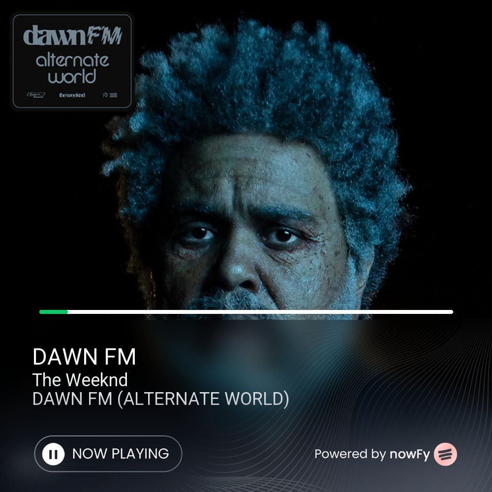
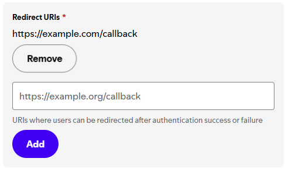
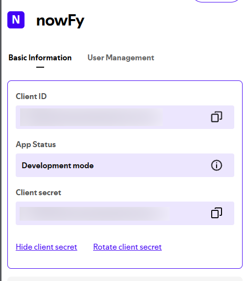
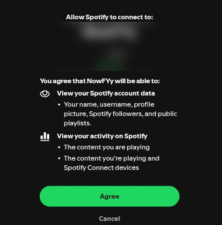
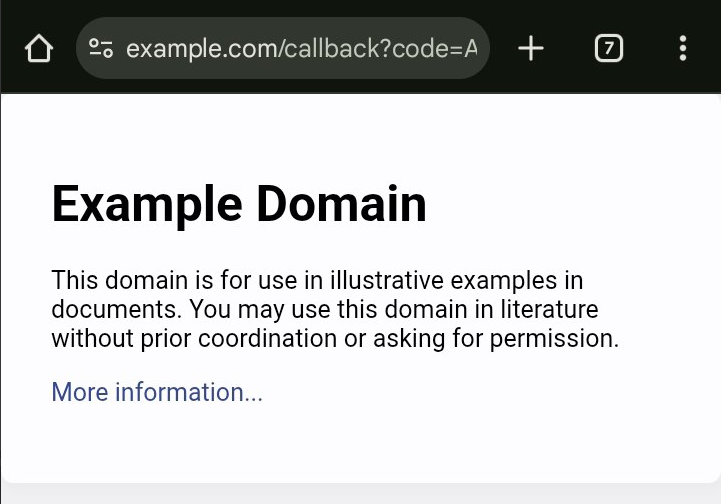

# Spotify Plugin – Step-by-Step Login Guide
 
This guide will help you set up your Spotify credentials and use the plugin to display your currently playing track.

---

## 1. Create a Spotify Developer App

- Go to [https://developer.spotify.com/dashboard](https://developer.spotify.com/dashboard)
- Click **"Create an App"**
- Fill in the app name and description
- **Add a Redirect URI** (required), e.g.:  
  `https://example.com/callback`

 
  
- Check the **“I understand”** box to accept Spotify’s terms
- Click **"Create"**

---

## 2. Get Your Credentials

- After creating the app, copy your **Client ID** and **Client Secret**

 

---

## 3. Set Credentials in the Plugin

In your chat with the plugin, send:

```
.setid YOUR_CLIENT_ID
```
Then: 

```
.setsecret YOUR_CLIENT_SECRET
```


## 4. Authorize the App

Open the link below in your browser, replacing `YOUR_CLIENT_ID` with your actual Client ID:

```
https://accounts.spotify.com/authorize?client_id=YOUR_CLIENT_ID&response_type=code&redirect_uri=https://example.com/callback&scope=user-read-currently-playing%20user-read-playback-state
```

Log in with your Spotify account and approve the app.  
You'll be redirected to a URL like:



```
https://example.com/callback?code=YOUR_CODE_HERE
```



---

## 5. Submit the Code

Copy the `code` from the URL and send it to the plugin:

```
.code YOUR_CODE_HERE
```


---

## 6. Check if Everything Works

Send the command below to confirm if the setup is correct:

```
.check
```

---

## 7. Show What You’re Listening To

Use this command to show the current track you’re playing:

```
.now
```
## Need Help?

Join the support group: [@ApplePluginsChat](https://t.me/ApplePluginsChat) or [@exteraDevPlugins](https://t.me/exteraDevPlugins)
